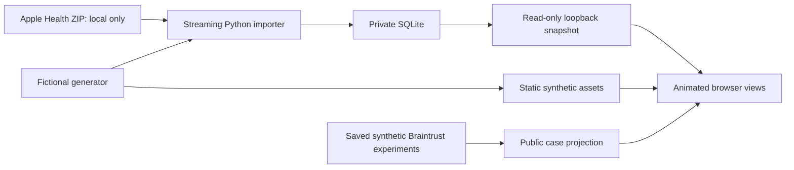

# Procedure and architecture

## Data flow



`living/export.py` selects eight workouts and thirty nights for the visual experience. Heart-rate values are grouped in five-second bins. The browser uses the latest preceding sample only, with a thirty-second freshness boundary; it never borrows a future sample. Normalized route coordinates preserve approximate aspect ratio. They are not geographic coordinates and are still treated as private when sourced from personal data.

`living/serve.py` serves `dist/` and optionally exposes `/api/snapshot` and `/api/investigate`. It binds to `127.0.0.1`, checks Host and Origin, limits request size, and avoids logging request bodies. The investigator uses bounded, allowlisted tools and a read-only health connection. The static hosted experience has no Python API or live Braintrust credential.

## Bring your own Apple Health export locally

On iPhone, open Health, tap your profile, then Export All Health Data. Keep the resulting ZIP outside this checkout. Import it into the ignored local directory:

```sh
python3 -m observatory.ingest '/absolute/path/to/export.zip' --db .local/health.sqlite --timezone America/Denver
python3 -m living.serve --db .local/health.sqlite
```

Open the local app and choose **Use local snapshot**. Personal observations stay on your machine. Do not copy that database, local API responses, or screenshots of personal scenes into public `dist/` or GitHub. `python3 -m living.build_demo` accepts no personal input and always regenerates fictional public assets.

## Investigator and evaluations

```sh
python3 -m observatory.demo --db .local/demo.sqlite
python3 -m observatory.investigator.agent 'Show burro slow moments' --db .local/demo.sqlite
python3 -m observatory.investigator.evaluate --db .local/demo.sqlite --out .local/evaluation.json --strict
python3 -m observatory.investigator.retrieval_eval --help
```

Optional provider, graph, and telemetry adapters are in `observatory/investigator/`. Install `requirements-agent.txt` only when using those integrations. Follow each module's `--help`; configure provider keys through your shell or secret manager, never the browser or source files. Braintrust synchronization generates its own synthetic dataset, persists experiments, reads them back, and writes a report. Rebuilding visual assets projects that report into `dist/braintrust.json`.

`docs/evidence/braintrust-evidence.json` is the inherited saved report from Athlete Observatory: three verified forty-case experiments. The public visualization does not query Braintrust live. Its experiment links require the appropriate Braintrust account. Local baseline and improved runs use deterministic routing; Nebius used a model planner. Development-set accuracy should not be generalized to unseen questions. Latency is the recorded run's latency, not a browser animation timing or service SLO.

## CI and release procedure

1. Make source changes and run `npm run check`, `npm test`, and `python3 -m unittest discover -s tests -v`.
2. Rebuild fictional assets with `python3 -m living.build_demo`. Review JSON and data provenance.
3. Capture affected UI states in a browser. Save unmodified screenshots to `docs/screenshots/`, update their SHA-256 hashes in `manifest.json`, and update the coverage guide.
4. Run `python3 -m living.verify`. Review staged filenames and changes for secrets or personal data, then commit and push.
5. GitHub Actions repeats tests, checks generated-data drift, evaluates forty local cases, verifies image hashes, and uploads `dist/` as a fourteen-day artifact.
6. For Sites hosting, push the same source revision to the registered Site's source repository using a short-lived per-command credential, package the validated static directory, save that exact revision, and deploy the saved version. Confirm a successful deployment before sharing its URL. Do not store credentials in Git configuration or files.

The workflow is automated verification and artifact delivery. Production promotion to Sites is performed separately; it is not claimed to auto-deploy on every GitHub push. The Site starts owner-private. To deploy a fork, register your own Site instead of reusing this repository's project ID. The same `dist/` can also be served by a static host of your choice.

## Evidence limits

The gallery records real browser renders of fictional health fixtures and saved synthetic agent cases. Screenshots cannot demonstrate motion; playback was also checked through changing heart transform values, and timing semantics are covered by JavaScript tests. The gallery covers defined product states, not every operating system, browser, network failure, or possible dataset. Its narrow capture is a 649-pixel-wide layout, not proof of every phone size.
